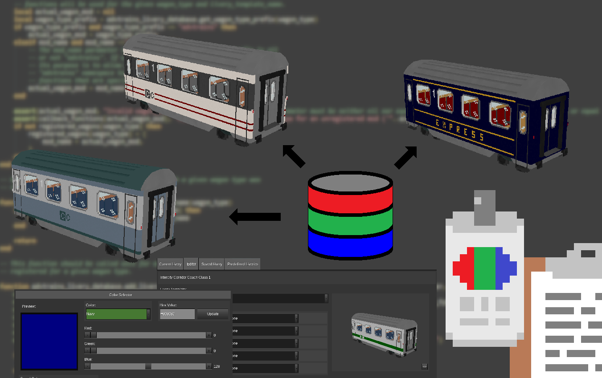

# AdvTrains Livery Tools

Currently in Beta release, AdvTrains Livery Tools is an extension for [Advanced Trains](https://content.minetest.net/packages/orwell/advtrains/) that adds APIs for mod developers to support more livery options for their wagons and locomotives.  It also adds a livery designer tool that can be used by players in-game to view and customize the liveries of their wagons and locomotives from participating mods.

## Included mods

Please see the README file in each of the included mod folders for detailed information.

- **AdvTrains Livery Database** - This mod provides an API for AdvTrains mods to register their wagons and associated livery information with a non-persistent in-game database for sharing with other mods.  Other mods can then use this data to preview, manipulate or apply livery designs to registered wagons.
- **AdvTrains Livery Designer** - This mod provides an in-game tool that enables players to view and modify the livery of their wagons.  *The wagons must be from participating mods that register their wagons with the AdvTrains Livery Designer and that have livery information added to the AdvTrains Livery Database.*  The **Classic Coaches** mod is an example of a participating mod.

## Design Goals

This modpack is the key component of a livery customization system for Advanced Trains designed to benefit both players and mod developers.  The design goals for the livery customization system included the following:

* Provide an Advanced Trains specific alternative for the commonly used bike painter tool that offers more in-game wagon livery customization options for wagon owners.  The new designer tool should be able to work interchangeably with the bike painter tool in that the new tool should be able to customize wagons previously painted with the bike painter tool and the bike painter tool should be able to paint wagons previously updated with the new designer tool.
* Develop a livery sharing mechanism that allows mods to share and extend livery customization information.
* Support some of the livery customization features found in some existing wagon mods by providing for optional callback functions that can be used by those mods can handle their particular implementations.
* Implement support for a "livery pack" concept in which mod developers can create mods that extend the livery customization options for wagons that are defined in other mods that participate in this livery customization system.
* Support mods that add tools and nodes that can interact with a wagon's livery and appearance.
* Allow for easy extension of livery customization options.  In other words, it should be relatively easy to extend the number and type of customization options that can be included in a livery template.  It is not assumed, however, that updating the livery designer tool to accommodate such additions will necessarily also be as easy.

Note that fully achieving and maintaining all of these goals could require some trade-offs that might limit some of the customization options that can be supported.   Those will need to be evaluated as they arise to find the right balance between ease-of-use and capability.

## Definition of key terms

**Appearance** - The overall appearance of a wagon or locomotive can include several factors, including it livery, its loads (if it's a freight wagon), its apparent age, service information (display boards, line number, etc.), its unit number, etc.

**Livery** - The paint/color scheme of a wagon or locomotive, including logos and other decorative markings.  A livery typically represents the brand or identity of the railway organization that owns the vehicle.  A vehicle's livery is not the only factor that can affect a wagon's appearance.

**Loads** - Freight wagons can have items in their inventory that affect their appearance.  These items are sometimes referred to as loads in this context.  Wagons that have loads can require alternate models and/or textures to be used in constructing their appearance.

**Texture** - An image file that is used in constructing the appearance of a wagon or locomotive.  More than once texture can be used to construct that appearance.

## Author's Notes

1) The included **AdvTrains Livery Designer** is a *livery* designer, not an appearance designer.  Other factors that impact the appearance of a wagon or locomotive are handled separately by other tools, other nodes, or by special code in their respective mods.

## Licenses

Copyright © 2023 Marnack

- AdvTrains Livery Tools code is licensed under the GNU AGPL version 3 license, see [LICENSE.txt](LICENSE.txt) for details.
- Unless otherwise specified, AdvTrains Livery Tools (images, textures and sounds) are licensed under [CC BY-SA 3.0 Unported](https://creativecommons.org/licenses/by-sa/3.0/).

