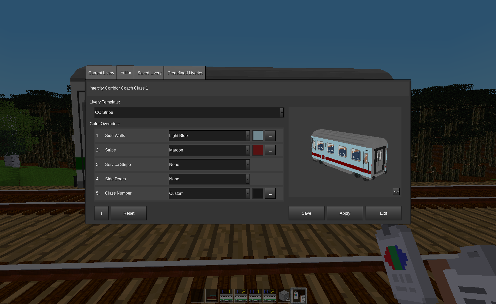
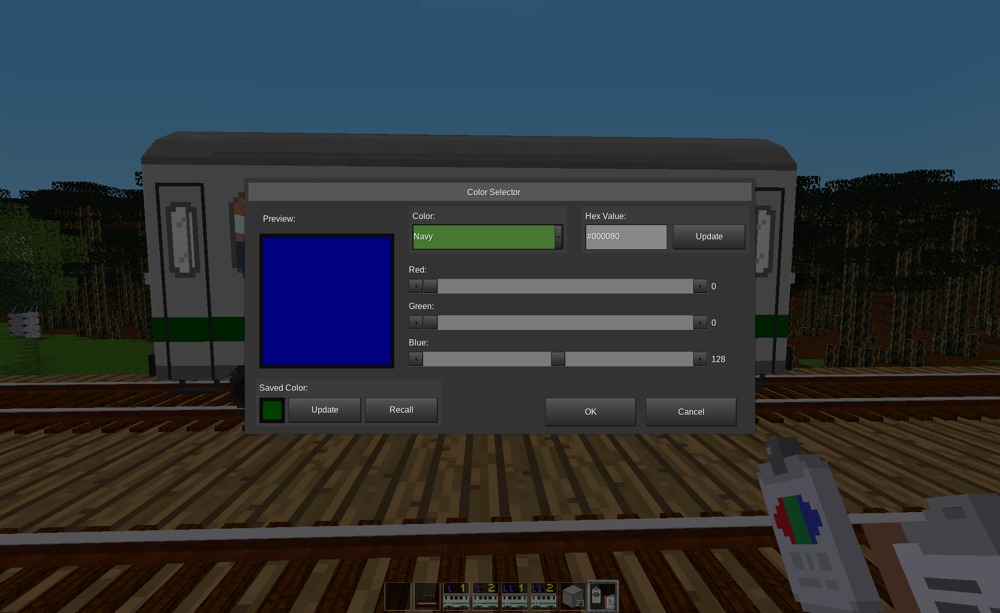

# AdvTrains Livery Designer
This mod adds an in-game tool for customizing the livery of wagons and locomotives of participating mods for [Advanced Trains](https://content.minetest.net/packages/orwell/advtrains/).

## The User Interface
The user interface is displayed when the player punches a wagon that is owned by the player while holding the livery designer tool (a spray paint can with clipboard). Note that the wagon must be from a mod that supports the livery designer tool. **Classic Coaches** is one such mod. If the wagon does not support the tool, a standard **Advanced Trains** chat message will be shown informing the player how to destroy the wagon.  (No, that is not intended as humor, it's just a limitation of the current implementation.)

There are four tabs at the top of the user interface that provide access to the tool's functions; "Current Livery", "Editor", "Saved Livery" and "Predefined Liveries". The first time a player uses the tool in a game session it will open to the "Editor" tab. Thereafter, it will open to the tab that was active when the tool was last exited.

All four tabs share a few common elements. Each tab shows the type of wagon that was punched to activate the tool and has an "Exit" button that will close the tool. They also all have an Interactive Preview control that shows a preview of the relevant livery for that particular tab. This preview shows a 3D view of the wagon which the user can rotate via click-and-drag in the preview window. In the lower right corner of the preview there is a "<>" button that can be used to enlarge the preview. (Once enlarged, there is a "><" button to collapse the preview back to normal size.)  The Current Livery tab and the Saved Livery tab add a "Rotate" checkbox to the lower left corner of the preview that will cause to 3D model to rotate continuously without any interaction.

### The Current Livery tab
The tab shows a read-only view of the wagon's current livery design.

#### Edit Button
The "Edit" button will appear whenever the current livery is different from the livery currently in the Editor. Clicking on the button will copy the current livery to the Editor tab and activate the Editor tab. The livery design that was previously in the Editor tab will be overwritten.

### The Editor tab
The Editor tab is similar to the Current Livery tab except that additional controls are displayed for manipulating the design.

#### Livery Template drop list
The first control is the Livery Template drop list. This drop list will show all of the available livery templates that have been defined for the current type of wagon. Different types of wagons can have very different sets of livery templates.

#### Color Overrides List
Color overrides are currently the only type of parameter that can be defined in a livery template. The Color Overrides list shows all of the possible color overrides that have been defined for the selected template. Each row of the color override list shows its index number, name and currently selected color override value. The color override value is in a drop list control that includes the values, "None", "Custom" and various color names for quick selection. If any value other than "None" is selected, a color sample of the current selection is shown. To the right of the color sample is a "..." button that can be used to display the Color Selector form (see below) for editing the color.

#### Reset Button
The reset button will be displayed if one or more of the current template's parameters have been customized. Clicking on the button will reset all of the template's parameters to their default values.

#### Save Button
The "Save" button will be displayed if the livery design currently in the editor is different from the livery in the Saved Livery tab. Clicking on the button will copy the current livery to the Saved Livery tab and activate the Saved Livery tab. The livery design that was previously in the Saved Livery tab will be overwritten.

#### Apply Button
The "Apply" button will be displayed if the livery design currently in the editor is different from the livery of the wagon that was punched to activate the tool. Clicking on the button will immediately apply the livery design to the wagon. The livery design tool will remain open.

### The Saved Livery tab
The tab shows a read-only view of the most recently saved livery design.

Note that the saved livery design will be preserved until either the player leaves the game or the player activates the tool on a wagon that does not support the saved livery design. Another way to think of this is that there is one memory slot for saved livery designs that is shared between all wagon types and that activating the tool on a wagon that is not compatible with the saved design will cause the saved design to be cleared immediately.

#### Edit Button
The "Edit" button will appear whenever the saved livery is different from the livery currently in the Editor. Clicking on the button will copy the saved livery to the Editor tab and activate the Editor tab. The livery design that was previously in the Editor tab will be overwritten.

#### Apply Button
The "Apply" button will be displayed if the saved livery design is different from the livery of the wagon that was punched to activate the tool. Clicking on the button will immediately apply the livery design to the wagon. The livery design tool will remain open.

### The Predefined Liveries tab
The Predefined Liveries tab shows a list of livery designs that have been defined by the mod creator. These designs are expected to showcase a few of the designs that are possible with the provided livery templates.

#### Edit Button
The "Edit" button will appear whenever the currently selected predefined livery is different from the livery currently in the Editor. Clicking on the button will copy the currently selected livery to the Editor tab and activate the Editor tab. The livery design that was previously in the Editor tab will be overwritten.

#### Apply Button
The "Apply" button will be displayed if the currently selected predefined livery design is different from the livery of the wagon that was punched to activate the tool. Clicking on the button will immediately apply the selected livery design to the wagon. The livery design tool will remain open.

### Color Selector form
The Color Selector form is used to allow the player to specify and preview any RGB color in addition to the set of named colors that are provided for quick selection. This form provides multiple methods for specifying a color:
* Selecting a color by name from a drop list control
* Specifying an RGB color string (for example, "#FF80B4") and clicking on the adjacent "Update" button.
* Adjusting the RGB values independently via slider controls

The form also supports a saved color value. Clicking on the saved color value's "Update" button stores the current color into the saved color value. Clicking on the "Recall" button sets the current color value to be the same as the saved color value. The saved color value is preserved when the color selection form is closed but not when the player leaves the game.

### Player Tips
Here are a few tips when using the designer tool:
* When using a mouse with a scroll wheel, hover over any color drop list control and scroll the wheel to quickly cycle through the named colors. The colors are listed in "color order" rather than alphabetical order in order to make finding the desired shade a little easier.
* Use the saved color value from the Color Selector form to to copy colors between overlays. That is, open the Color Selector form for an override color that you want to copy, click on the saved color value's "Update" button, cancel the Color Selector form, open the Color Selector form for an override color that you want to update, click on the "Recall" button and then the form's "OK" button.
* Use the Saved Livery tab for applying the same livery design to multiple wagons. Because the designer tool opens to the last active tab, the Saved Livery can be used to more efficiently apply a livery design to multiple wagons of the same type. To do this, first save the desired livery design to the Saved Livery tab and then click on the "Exit" button. Then punch a wagon you want to update, click on the "Apply" button and then the "Exit" button. Repeat for each wagon to be updated.

### Mod Developer Information
This section is yet to be written.  In the mean time, see the *API reference guide* in the **AdvTrains Livery Database** mod for some information about adding support for this tool to a new or existing mod.

## Game Support
As with **AdvTrains**, the AdvTrains Livery Designer mod is compatible with many games when playing in creative mode and fully supports survival mode in [Minetest Game](https://content.minetest.net/packages/Minetest/minetest_game/) and its many variants.  However, AdvTrains Livery Designer also supports survival mode in games that are not based on **Minetest Game** including the following:

- [Farlands Reloaded](https://content.minetest.net/packages/wsor4035/farlands_reloaded/)
- [Hades Revisited](https://content.minetest.net/packages/Wuzzy/hades_revisited/)
- [Minecloneia](https://content.minetest.net/packages/ryvnf/mineclonia/)
- [VoxeLibre](https://content.minetest.net/packages/Wuzzy/mineclone2/) (formerly known as MineClone2)

Note that support for survival mode in those games is subject to potential breakage in the future if those games change their materials or crafting system.

## Licenses

Copyright © 2023-2025 Marnack

- AdvTrains Livery Designer is licensed under the GNU AGPL version 3 license.
- Unless otherwise specified, AdvTrains Livery Designer media (textures and sounds) are licensed under [CC BY-SA 3.0 Unported](https://creativecommons.org/licenses/by-sa/3.0/).

